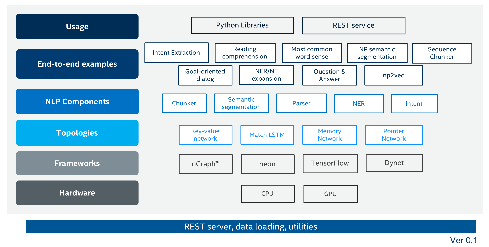

# NLP Architect by Intel® AI LAB

[](https://github.com/NervanaSystems/nlp-architect/blob/master/LICENSE)
[](http://nlp_architect.nervanasys.com)


NLP Architect is an open-source Python library for exploring the state-of-the-art deep learning topologies and techniques for natural language processing and natural
language understanding. It is intended to be a platform for future research and
collaboration.

The current version of NLP Architect includes these features that we found interesting from both research perspectives and practical applications:

* NLP core models that allow robust extraction of linguistic features for NLP workflow: for example, dependency parser (BIST) and NP chunker
* NLU modules that provide best in class performance: for example, intent extraction (IE), name entity recognition (NER)
* Modules that address semantic understanding: for example, colocations, most common word sense, NP embedding representation (e.g. NP2V)
* Components instrumental for conversational AI: for example, ChatBot applications, including dialog system, sequence chunking and IE
* End-to-end DL applications using new topologies: for example, Q&A, machine reading comprehension

<center> </center>

The library consists of core modules (topologies), data pipelines, utilities and end-to-end model examples with training and inference scripts. We look at these as a set of building blocks that were needed for implementing NLP use cases based on our pragmatic research experience. Each of the models includes algorithm descriptions and results in the [documentation](http://www.nlp_architect.nervanasys.com/).

Some of the components, with provided pre-trained models, are exposed as REST service APIs through NLP Architect server. NLP Architect server is designed to provide predictions across different models in NLP Architect. It also includes a web front-end exposing the model annotations for visualizations. Currently, we provide 2 services, BIST dependency parsing and NER annotations. We also provide a template for developers to add a new service.

<center> </center>


Because of its current research nature, several open source deep learning frameworks are used in this repository including:

* [Intel® neon](https://github.com/NervanaSystems/neon)
* [Intel® Nervana™ graph](https://github.com/nervanasystems/ngraph-python)
* [Tensorflow](https://www.tensorflow.org/) or [Intel-Optimized TensorFlow](https://software.intel.com/en-us/articles/intel-optimized-tensorflow-wheel-now-available)
* [Keras](https://keras.io/)
* [Dynet](https://dynet.readthedocs.io/en/latest/)

Overtime the list of models included in this space will change, though all generally run with Python 3.5+

## Documentation
Framework documentation on NLP model, algorithms, and modules, and instructions on how to contribute can be found [here](http://www.nlp_architect.nervanasys.com/).

## Installation

We recommend installing NLP Architect within a virtual environment to ensure a self-contained environment.
To install NLP Architect within an already existing virtual environment, see below installation recipe for custom installation.
The default installation will create a new local virtual environment and install the library in development mode.

To get started using our library, clone our repository:
```
  git clone https://github.com/NervanaSystems/nlp-architect.git
  cd nlp-architect
```
### Installing within a virtual environment

Install in development mode (default):
```
make
```

Complete install:
```
make install
```

Activate the newly created virtual environment:
```
. .nlp_architect_env/bin/activate
```
Fire up your favorite IDE/text editor/terminal and start running models.

### Installing to current working python (or system wide install)

Install in development mode:
```
make install_no_virt_env
```

System-wide install (might require `sudo` permissions):
```
make sysinstall
```

## Disclaimer
The NLP Architect is released as a reference code for research purposes. It is not an official Intel product, and the level of quality and support may not be as expected from an official product. Additional algorithms and environments are planned to be added to the framework. Feedback and contributions from the open source and NLP research communities are more than welcome.

## Contact
Contacting the NLP Architect development team through Github issues or email: nlp_architect@intel.com
