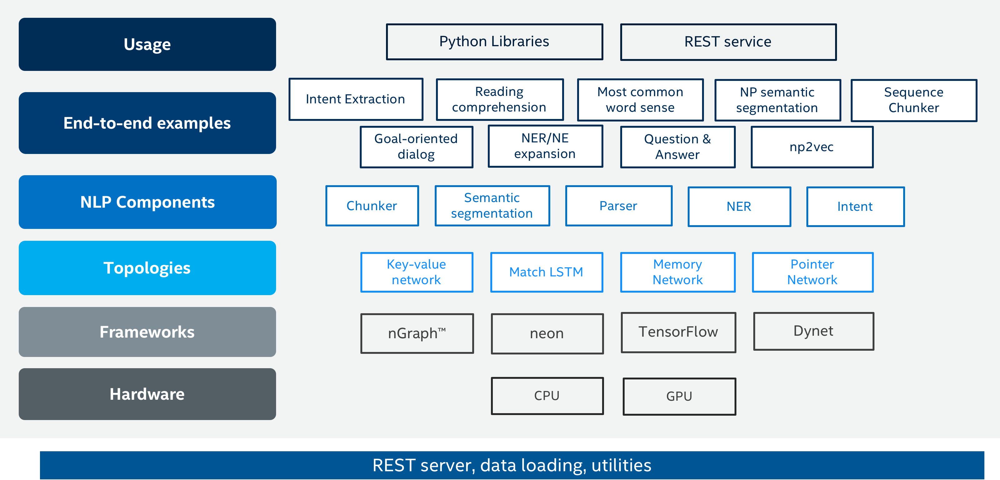
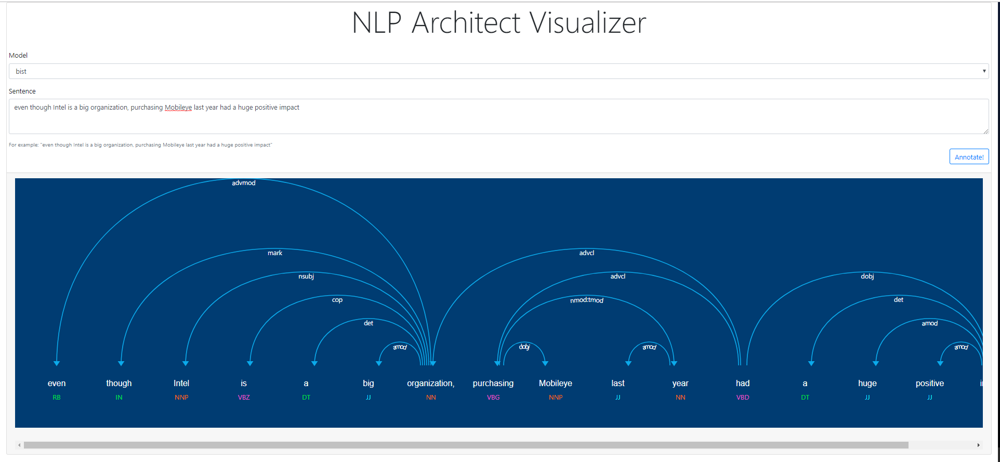
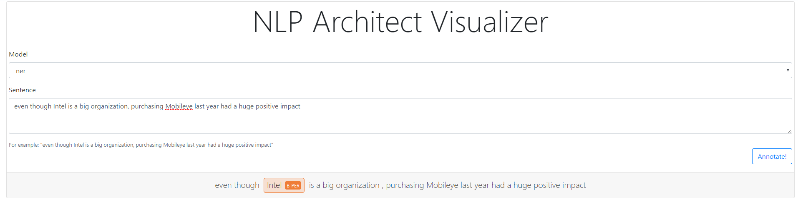
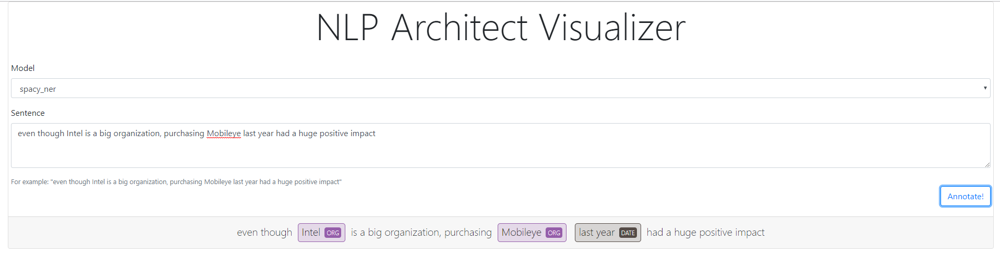

# NLP Architect by Intel® AI LAB

NLP Architect is an open-source Python library for exploring state-of-the-art
deep learning topologies and techniques for natural language processing and
natural language understanding. It is intended to be a platform for future
research and collaboration.

## Documentation
Framework documentation on NLP models, algorithms, and modules, and instructions
on how to contribute can be found at our main [documentation] site.

## Installation
Installing NLP Architect within a virtual environment to ensure a self-contained
environment is recommended. To install NLP Architect within a new or already-existing
virtual environment, or to install it system-wide, see the "Custom installations"
section below.  

### Default installation (works with Python 3.n+ only)
To get started, clone our repository:

    $ git clone https://github.com/NervanaSystems/nlp-architect.git
    $ cd nlp-architect

Note that the `setuptools` package from a recent version of `pip` is needed to
get the `make` command to build properly.

    $ pip3 install -U setuptools  

Install in development mode (default):

    $ make

Activate the newly-created virtual environment:

    $ . .nlp_architect_env/bin/activate

Fire up your favorite IDE/text editor/terminal and start running models.

### Custom installations

* **Python 3 `venv`**  The default installation instructions create a venv named
  `.nlp_architect_env`.  If this is not ideal for your needs, (for example,
  if you want to name it something else or use an already-existing virtual env),
  simply create or enter the local virtual environment you want to use, activate
  it, and install the library in development mode with:

    $ (py3_venv) make install_no_virt_env

  **Note** that `setuptools` from a recent version of `pip` is needed to get the
  `make` command to build properly.  

* **System-wide install** -- A system install might require `sudo` permissions:

    $ make sysinstall

_Note that all installations use CPU-based installations of Tensorflow/Dynet/Neon/nGraph. To install GPU supported binaries please refer to the framework's website for installation instructions._

## NLP Architect overview

The current version of NLP Architect includes these features that we found
interesting from both research perspectives and practical applications:

* NLP core models and NLU modules that provide best in class performance: Intent
  Extraction (IE), Name Entity Recognition (NER), Word Chunker, Dependency parser (BIST)
* Modules that address semantic understanding: co-locations, most
  common word sense, NP embedding representation (NP2Vec)
* Components instrumental for conversational AI: ChatBot
  applications (Memory Networks for Dialog, Key-Value Memory Networks), Noun Phrase extraction
* End-to-end DL applications using new topologies: Q&A, machine
  reading comprehension, Language modeling using Temporal Convolution
  Networks (TCN), Unsupervised Cross-lingual embeddings.
* Solutions using one or more models: Set Term expansion which
  uses the included word chunker as a noun phrase extractor and NP2Vec.

 

The library consists of core modules (topologies), data pipelines, utilities
and end-to-end model examples with training and inference scripts. We look at
these as a set of building blocks that were needed for implementing NLP use
cases based on our pragmatic research experience. Each of the models includes
algorithm descriptions and results in the [documentation].

Some of the components, with provided pre-trained models, are exposed as REST
service APIs through NLP Architect server. NLP Architect server is designed to
provide predictions across different models in NLP Architect. It also includes
a web front-end exposing the model annotations for visualizations. The server
supports extensions via a template for developers to add a new service. For
detailed documentation see this
[page](http://nlp_architect.nervanasys.com/service.html).

Below are examples of NLP Architect server in action

BIST Parser UI

 

NER Parser UI

 

Spacy NER Parser UI

 

### Deep Learning Frameworks
Because of its current research nature, several open source deep learning
frameworks are used in this repository including:

* [Intel® nGraph Python API]
* [TensorFlow]
* [Intel-Optimized TensorFlow]
* [Keras]
* [Dynet]

NLP Architect is an active space of research and development; Throughout future
releases new models, solutions, topologies and framework additions and changes
will be made. We aim to make sure all models run with Python 3.5+. We
encourage researchers and developers to contribute their work into the library.

## Disclaimer
The NLP Architect is released as reference code for research purposes. It is
not an official Intel product, and the level of quality and support may not be
as expected from an official product. Additional algorithms and environments are
planned to be added to the framework. Feedback and contributions from the open
source and NLP research communities are more than welcome.

## Contact
Contact the NLP Architect development team through Github issues or
email: nlp_architect@intel.com

[documentation]:http://nlp_architect.nervanasys.com
[Intel® nGraph Python API]:http://ngraph.nervanasys.com/docs/latest/python_api/index.html
[Intel-Optimized TensorFlow]:https://software.intel.com/en-us/articles/intel-optimized-tensorflow-wheel-now-available
[Intel® neon]:https://github.com/NervanaSystems/neon
[TensorFlow]:https://www.tensorflow.org/
[Keras]:https://keras.io/
[Dynet]:https://dynet.readthedocs.io/en/latest/
