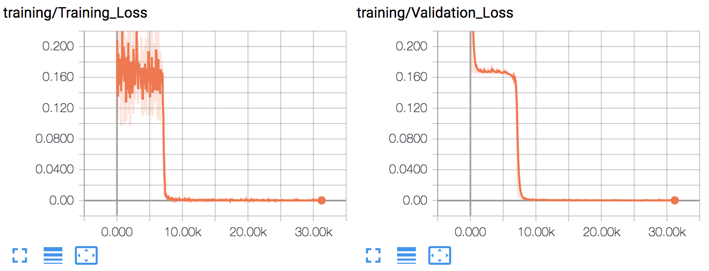

This script implements the toy *adding problem* task from the TCN paper. The input to the adding problem consists of a sequence of numbers between zero and one, as well as a mask which masks all but two entries in the sequence. The objective of the adding problem is to train a neural network which determines the sum of the elements of the sequence that are not masked out. This synthetic test can show that a TCN can solve problems that have long temporal dependencies. For more details please read the [paper](https://arxiv.org/abs/1803.01271). 

To train the model, run as follows:
```bash
     python ./adding_with_tcn.py --batch_size 32 --dropout 0.0 --epochs 20 --ksize 6 --levels 7 --seq_len 200 --log_interval 100 --nhid 27 --lr 0.002 --results_dir ./
```

The following tensorboard snapshots shows the result of a training run; plots for the training and validation loss are provided. 


