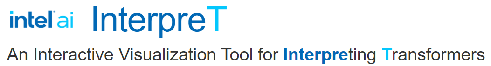

## Part of NLP Architect by Intel® AI Lab

## Overview
With the increasingly widespread use of Transformers for NLU/NLP tasks, there is growing interest in understanding the inner workings of these models, why they are so effective at a wide range of tasks, and how they can be further tuned and improved. To further this goal of explainability and comprehension, we present **InterpreT**, a system for facilitating the understanding of Transformer behaviors. **InterpreT** is a generally applicable tool, and its functionalities are demonstrated through an analysis of model behaviors for two disparate tasks: the Winograd Schema Challenge (WSC) and Aspect Based Sentiment Analysis (ABSA). In addition to providing various mechanisms for investigating general model behaviors, **Interpret** enables novel, granular analysis by probing and visualizing the internal representations of Transformer models at the layer level, empowering users with new insights into how and what their models are learning.

## InterpreT Live Demo
A live demo of **InterpreT** for analyzing pre-trained and fine-tuned BERT behavior on WSC can be accessed at the following link: http://interpret.intel-research.net. We highly encourage users to take a look at the screencast video demo below to get a sense of how the application works and how to navigate the application.

Below are some interesting phenomena we encourage users to explore in the live demo:
- In our own analysis we found that a fine-tuned BERT model pushes closer together the embeddings of terms it predicts to be coreferent. This behavior can be seen in the "Average t-SNE Distance Per Layer" plot in the bottom left when using the multi-select feature on the t-SNE plot. 
- The metric "finetuned_coreference_intensity" (which can also be used with the multi-select) in the Head Summary plot shows that the 7th head of layer 10 often places high attention between coreferent mention spans. This attention head can also be visualized in "Attenion Matrix/Map" plot for various examples. 

## Screencast Video Demo

