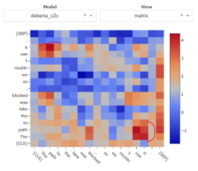

  

 
### Part of NLP Architect by Intel® AI Lab

## Overview
With the increasingly widespread use of Transformer-based models for NLU/NLP tasks, there is growing interest in understanding the inner workings of these models, why they are so effective at a wide range of tasks, and how they can be further tuned and improved. In order to contribute to enhanced model explainability and comprehension, we present **InterpreT**, an Interactive visualization tool for interpreting transformers. While **InterpreT** is a task agnostic tool, its functionalities are demonstrated through analysis of model behaviours for two disparate tasks: the Winograd Schema Challenge (WSC) and Aspect Based Sentiment Analysis (ABSA). In addition to providing various mechanisms for investigating general model behaviours, **InterpreT** enables novel, granular analysis by probing and visualizing the hidden representations of tokens at the layer level, empowering users with new insights regarding how and what their models are learning. A [screencast video](https://youtu.be/np3cT9Xt9PE) and a [live demo](http://interpret.intel-research.net) illustrate these points.

## Screencast Video

  

## InterpreT Live Demo
A live demo of **InterpreT** for analyzing pre-trained and fine-tuned BERT behavior on WSC can be accessed at the following link: 
**http://interpret.intel-research.net**

 

The [live demo](http://interpret.intel-research.net) allows comparison of pre-trained BERT with BERT fine-tuned on WSC. Specifically, the user can explore how the attention heads and the contextualized embeddings change between these two models. We highly encourage users to watch the [screencast video](https://youtu.be/np3cT9Xt9PE) to get a sense of how the application works and how to navigate the application.

Below are some interesting phenomena we encourage users to explore in the [live demo](http://interpret.intel-research.net):
- In our analysis, we found that the embeddings of tokens which are predicted to be coreferents are in closer proximity in the embedding space, especially when BERT is fine-tuned for the coreference resolution task. This behaviour can be seen in the "Average t-SNE Distance Per Layer" plot in the bottom left when using the multi-select feature on the t-SNE plot. 
- The metric "finetuned_coreference_intensity" (which can also be used with the multi-select) in the head summary plot shows that the 7th head of layer 10 often places high attention between coreferent mention spans. This attention head can also be visualized in the “Attention Matrix/Map" plot for various examples. 

## Example of Additional Application - DeBERTa : 

With minor changes, we extended InterpreT for another use case: analyzing [DeBERTA (
Decoding-enhanced BERT with Disentangled Attention)](https://arxiv.org/abs/2006.03654) on WSC. 
For this example, we finetuned DeBERTa on WSC and took a closer look at its attention heads using **InterpreT**.
More specifically, we used **InterpreT** to see how the overall attention matrix for a head is broken down into each of it disentangled attention components, and to analyze what kind of information is encapsulated by each comonent.
The following snapshots show some of the interesting behaviors that we found.

### Attention to previous token 
In the below figure, the leftmost plot shows the full attention matrix and the plots on the right show its 3 disentangled constituent terms, c2c, c2p, and p2c. Here we can see that the c2c attention matrix contains information that is spread out, while the attention matrices relating to position (p2c and c2p) encapsulate the "attention to previous" behavior.

### Attention to coreferents
In layer 10 head 3, we can see how in the full attention matrix, the focus of the attention is on the [SEP] token.
We also see this behavior in the position-related attention matrices (c2p and p2c). 
However, if we look at the c2c matrix, we find a new behavior that is invisible in the full attention matrix: high attention between coreferents.

## System Details
Please see the README file included in the [application folder](https://github.com/IntelLabs/nlp-architect/tree/master/solutions/InterpreT/application).