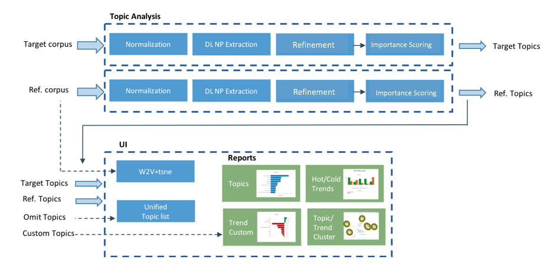

# Topic and Trend Analysis Solution

Topic Analysis is a Natural Language Processing (NLP) task of extracting salient terms (or topics) from a textual corpus. Trend Analysis task measures the change of the most prominent topics between two time points.

The solution is based on Noun Phrase (NP) Extraction from the given corpora. Each NP (topic) is assigned a proprietary *importance* score that represents the significance of the noun phrase in the corpora (document appearances, *phraseness* and *completeness*).

## Flow

The first stage is to extract the topics from the two textual corpora:

* A target corpus (e.g., current month’s financial reports)
* A reference corpus (e.g., last month’s financial reports).

The analysis is done by running the two corpora through the Topic Extraction pipeline: Normalization -> Noun Phrase extraction -> Refinement -> Scoring.
In this stage, the algorithm will also train a W2V model on the joint corpora to be used for the clustering report (this step can be skipped).
In the second stage the topic lists are being compared and analysed.
Finally the UI reads the analysis data and generates automatic reports for extracted topics, “Hot” and “Cold” trends, and topic clustering in 2D space.

The noun phrase extraction module is using a pre-trained [model](https://s3-us-west-2.amazonaws.com/nlp-architect-data/models/chunker/model.h5) which is available under the Apache 2.0 license. 

### Flow diagram



## Reports

```
Top Topics            highest scored topics from each corpora
Hot Trends            topics with highest positive change in scores
Cold Trends           topics with highest negative change in scores
Trend Clustering      scatter graph showing trends clusters
Topic Clustering      scatter graph showing topic clusters for each corpus
Custom Trends         topics selected by user to monitor (see section: Filter
                      Phrases and Custom Trends Selection)
```

## Usage

### First stage:

```
usage: topic_extraction.py [-h] [--notrain] [--url] [--single_thread]
                           target_corpus ref_corpus

positional arguments:
  target_corpus    a path to a folder containing text files
  ref_corpus       a path to a folder containing text files

optional arguments:
  -h, --help       show this help message and exit
  --notrain        skip the creation of w2v model
  --url            corpus is provided as csv file with urls
  --single_thread  analyse corpora sequentially

```
The topic lists will be saved to csv files, which are the input of the second stage.
When using the --url flag, both target_corpus and ref_corpus should be a csv file containing url links to analyze (a single url per row)

### Second stage:

```
usage: trend_analysis.py [-h] [--top_n TOP_N] [--top_vectors TOP_VECTORS]
                         target_topics ref_topics

positional arguments:
  target_topics         a path to a csv topic-list extracted from the target
                        corpus
  ref_topics            a path to a csv topic-list extracted from the
                        reference corpus

optional arguments:
  -h, --help            show this help message and exit
  --top_n TOP_N         compare only top N topics (default: 10000)
  --top_vectors TOP_VECTORS
                        include only top N vectors in the scatter graph
                        (default: 500)

```

The input to the second stage is the output lists from the first stage (topic extraction).
The analysis results will be saved into the data folder and will be used by the UI at the last stage.


### UI stage:

In order to visualize the analysis results run:

```
bokeh serve --show ui
```

You can also load the ui as a server using bokeh's options --address and --port, for example:
```
bokeh serve ui --address=12.13.14.15 --port=1010 --allow-websocket-origin=12.13.14.15:1010
```
and then access it through a browser: http://12.13.14.15:1010/ui


## Filter Phrases and Custom Trends

By default, all topics will be analysed (according to the top N threshold, if provided), and the Custom Trends graph will be empty.
The user can filter phrases he wants to omit from the results (post analysis) by selecting the "Filter" radio button, click on the
 "Filter Topics" tab, and de-select the unwanted topics (currently de-selection is done by holding the Ctrl button and click on a cell).
Similarly, in order to select custom trends to be presented in the Custom Trends graph, click on the "Custom Trends" tab and select the phrases to show.

For a permanent custom/filtering, edit the 'valid'/'custom' column in the file: data/filter_phrases.csv
(assign 1 to show a phrase and 0 otherwise), save the file and refresh the reports web page.
